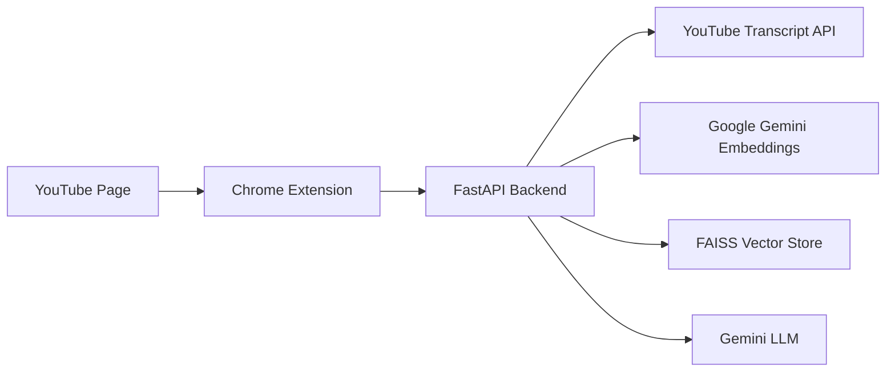

# YouTube RAG Extension

Chrome extension + FastAPI backend that lets you ask questions about any YouTube video that has a transcript available.

## Architecture



## Project structure

```
RAG-YT-EXTN/
├── backend/          # FastAPI + RAG pipeline
│   ├── main.py
│   ├── rag.py
│   ├── Dockerfile
│   └── requirements.txt
├── extension/        # Chrome MV3 side panel
└── render.yaml       # One-click deploy config
```

## Local development

### 1. Backend

```bash
cd backend
python -m venv .venv

# Windows
.venv\Scripts\activate

pip install -r requirements.txt
copy .env.example .env
```

Add your Google AI Studio API key to `backend/.env`:

```
GOOGLE_API_KEY=your_key_here
```

Start the API:

```bash
uvicorn main:app --reload --host 127.0.0.1 --port 8000
```

Verify: open [http://127.0.0.1:8000](http://127.0.0.1:8000)

### 2. Chrome extension

1. Open `chrome://extensions`
2. Enable **Developer mode**
3. Click **Load unpacked**
4. Select the `extension/` folder
5. Open any YouTube video
6. Click the extension icon to open the side panel

Default API URL is `http://127.0.0.1:8000`. Change it in **Settings (⚙)** after deploying.

## API endpoints

| Method | Path | Description |
|--------|------|-------------|
| GET | `/` | Health check |
| GET | `/video/{video_id}/status` | Transcript + index status |
| POST | `/video/register` | Index a video transcript |
| POST | `/chat` | Ask a question |

## Deploy backend (Render — recommended)

### Option A: Blueprint (render.yaml)

1. Push this repo to GitHub
2. Go to [render.com](https://render.com) → **New Blueprint**
3. Connect the repo
4. Set `GOOGLE_API_KEY` when prompted
5. Deploy

Render mounts a persistent disk at `/data` so indexed videos survive restarts.

### Option B: Manual Docker deploy

```bash
cd backend
docker build -t youtube-rag-api .
docker run -p 8000:8000 \
  -e GOOGLE_API_KEY=your_key \
  -v rag-data:/data \
  youtube-rag-api
```

### Other platforms

The same Docker image works on Railway, Fly.io, or any VPS:

- Expose port `8000`
- Set `GOOGLE_API_KEY`
- Mount persistent storage to `/data` (recommended)
- Set `VECTORSTORE_DIR=/data/vectorstores`

## Connect extension to production

1. Deploy the backend and copy the public URL (e.g. `https://youtube-rag-api.onrender.com`)
2. Open the extension side panel → **Settings**
3. Paste the URL and save
4. If your host is not in `extension/manifest.json` `host_permissions`, add it and reload the extension

Example — add your custom domain:

```json
"host_permissions": [
  "https://your-api.example.com/*"
]
```

## Environment variables

| Variable | Required | Default | Description |
|----------|----------|---------|-------------|
| `GOOGLE_API_KEY` | Yes | — | Google AI Studio API key |
| `GEMINI_MODEL` | No | `gemini-3.6-flash` | Chat model |
| `GEMINI_EMBEDDING_MODEL` | No | `models/gemini-embedding-001` | Embedding model |
| `PREFERRED_LANGUAGES` | No | `en,en-US,...` | Transcript language priority |
| `ALLOWED_ORIGINS` | No | `*` | CORS origins |
| `VECTORSTORE_DIR` | No | `vectorstores` | FAISS storage path |

## Notes

- Works for any video where YouTube provides a transcript (manual or auto-generated).
- First question on a new video triggers indexing; later questions are faster.
- Free-tier cloud hosts may sleep after inactivity — first request can take ~30s to wake up.
- Keep your API key secret. Never commit `.env` to git.

## Troubleshooting

| Issue | Fix |
|-------|-----|
| "No transcript for this video" | Video has captions disabled or unavailable |
| "Backend unreachable" | Check API URL in extension settings; ensure server is running |
| Slow first response | Normal — transcript fetch + embedding on first use |
| CORS errors from browser | Set `ALLOWED_ORIGINS=*` on the backend |
